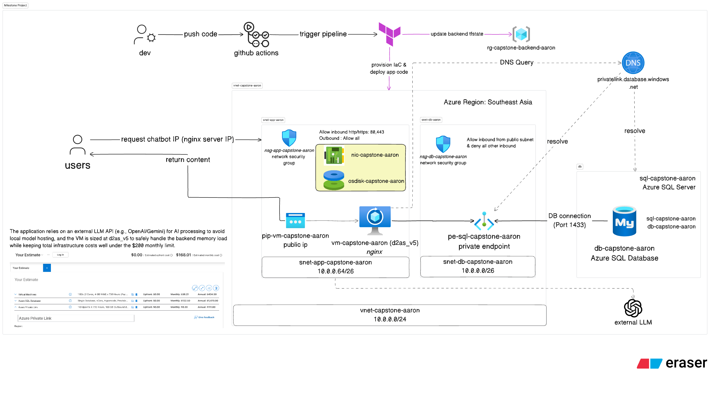
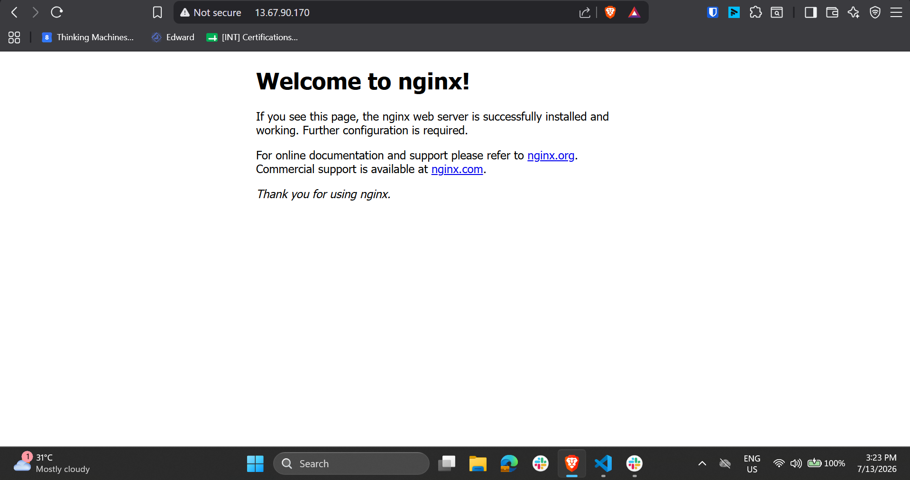

# Infra-design-milestone-aaron
This repository contains Infrastructure as Code to deploy a complete Azure environment with networking, Linux VMs, and managed SQL databases using Terraform.

This folder contains the Terraform configuration for the Azure infrastructure.

## Architecture



## Local setup

1. If you already have an SSH keypair, use your public key:

```bash
cat ~/.ssh/id_rsa.pub
```

If you do not have an SSH keypair yet, create one:

```bash
ssh-keygen -t ed25519 -f ~/.ssh/id_ed25519
```

or, if you need RSA:

```bash
ssh-keygen -t rsa -b 2048 -f ~/.ssh/id_rsa
```

2. Copy the example file and fill in your secrets:

```bash
cp infra/terraform.tfvars.example infra/terraform.tfvars
```

3. Edit `infra/terraform.tfvars` and set:
- `ssh_public_key` to the full one-line public key string from `~/.ssh/id_rsa.pub` or `~/.ssh/id_ed25519.pub`
- `sql_admin_password` to a secure password

4. Run Terraform from the `infra/` folder:

```bash
cd infra
terraform init
terraform plan -out=tfplan
terraform apply tfplan
```

## Verify the deployment

If the setup completed successfully, you should be able to:

1. SSH into the VM
```bash
ssh -i ~/.ssh/id_rsa azureuser@<vm-public-ip>
```

2. Open the public IP address of the VM in your browser and see the default Nginx welcome page
3. Confirm that the SQL private endpoint resolves correctly from the VM
```bash
nslookup <sql-server-name>.database.windows.net
nc -vz <sql-server-name>.database.windows.net 1433
```

If everything is working correctly, the browser should show the Nginx default page, similar to this:



If you do not see the page, check that the VM is running, the public IP is correct, and the network security group allows inbound HTTP traffic.

## CI/CD setup

The GitHub workflow uses the string-based SSH public key approach.

Set these secrets in GitHub:
- `AZURE_CLIENT_ID`
- `AZURE_CLIENT_SECRET`
- `AZURE_SUBSCRIPTION_ID`
- `AZURE_TENANT_ID`
- `SQL_ADMIN_PASSWORD`
- `SSH_PUBLIC_KEY` (the one-line public key string from `~/.ssh/id_rsa.pub`)

The workflow runs Terraform from the `infra/` directory and injects the public key via `TF_VAR_ssh_public_key`.

## Notes

- Do not commit `infra/terraform.tfvars`.
- Use the public key string, not the private key file.
- Keep SSH access restricted in production.
